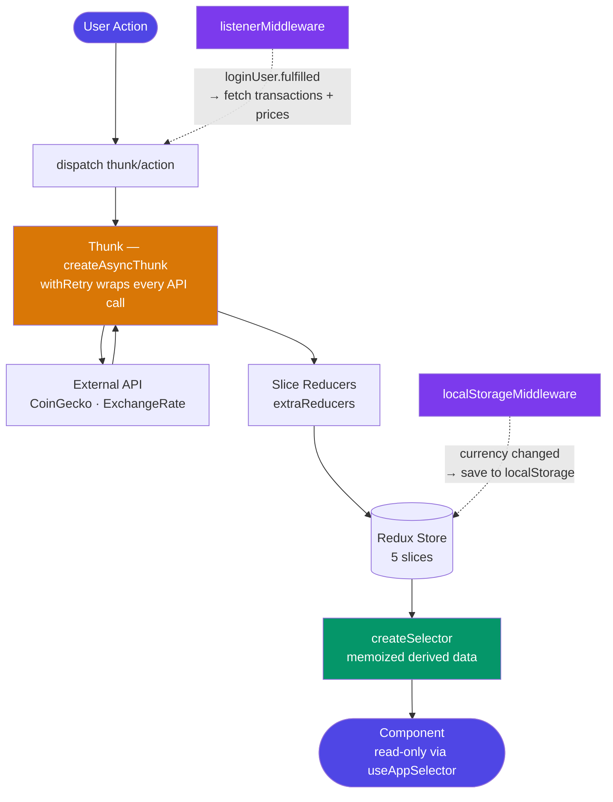
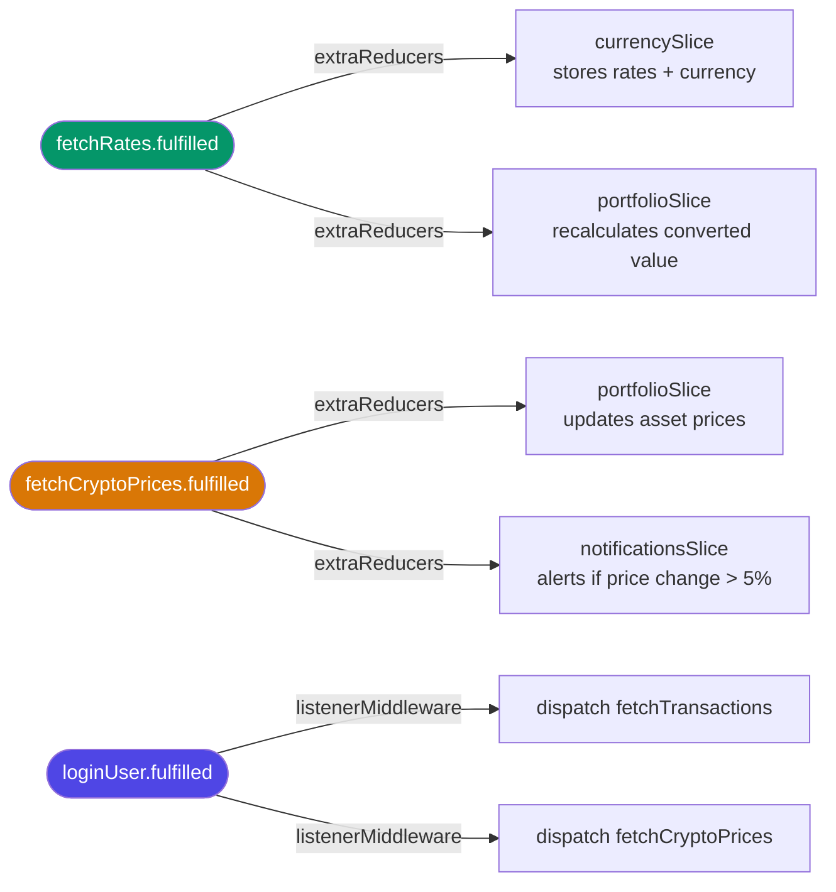

# WealthLedger

A personal finance dashboard built with Next.js 15, Redux Toolkit, and TypeScript. Tracks crypto portfolio value, transaction history, budget limits, and currency conversions — all in real time.

---

## Tech Stack

| Layer | Technology |
|---|---|
| Framework | Next.js 15 (App Router) |
| State | Redux Toolkit |
| Language | TypeScript (strict) |
| Styling | Tailwind CSS + next-themes (dark mode) |
| Crypto data | CoinGecko API (free, no key) |
| Exchange rates | ExchangeRate API (free, no key) |

---

## Quick Start

```bash
npm install
npm run dev
```

Open [http://localhost:3000](http://localhost:3000). Sign in with any email + password.

---

## Architecture

Every piece of data follows a single, one-directional path:

```
User Interaction
      │
      ▼
  dispatch()          ← only entry point into state
      │
      ▼
  Thunk               ← all async logic lives here (API calls, retries)
      │
      ▼
  Reducer             ← pure function, updates state
      │
      ▼
  Redux Store         ← single source of truth
      │
      ▼
  createSelector      ← derives display data (memoized)
      │
      ▼
  useAppSelector      ← component reads the result
      │
      ▼
  React Component     ← renders only, no logic
```

### Data Flow Diagram



### Cross-Slice Communication (3 patterns)



---

## Project Structure

```
src/
├── app/
│   ├── layout.tsx              ← Root layout: StoreProvider + ThemeProvider
│   ├── page.tsx                ← Landing page (links to sign-in)
│   ├── (app)/
│   │   ├── sign-in/page.tsx    ← Login form, dispatches loginUser
│   │   └── sign-up/page.tsx    ← Signup form, dispatches signupUser
│   └── dashboard/
│       └── page.tsx            ← Main dashboard, reads 9 selectors
│
├── store/
│   ├── store.ts                ← configureStore — wires all slices + middleware
│   ├── hooks.ts                ← useAppDispatch + useAppSelector (typed)
│   ├── listeners.ts            ← listenerMiddleware — cross-slice event reactions
│   ├── middleware/
│   │   └── localStorage.ts     ← persists selectedCurrency to localStorage
│   └── slices/
│       ├── authSlice.ts        ← user login/signup state
│       ├── transactionsSlice.ts← transactions, filters, budgets + 5 selectors
│       ├── portfolioSlice.ts   ← crypto holdings + 2 selectors
│       ├── currencySlice.ts    ← exchange rates, selected currency
│       └── notificationsSlice.ts ← price alerts, budget alerts
│
├── providers/
│   ├── StoreProvider.tsx       ← wraps Redux Provider (must be 'use client')
│   └── CurrencyHydrator.tsx    ← syncs localStorage currency after SSR
│
├── hooks/
│   └── usePolling.ts           ← setInterval every 60s for live price updates
│
├── utils/
│   └── retry.ts                ← withRetry — exponential backoff for all thunks
│
└── data/
    └── mockTransactions.ts     ← 62 static transactions (Feb–Apr 2026)
```

---

## The 5 Redux Slices

Each slice owns exactly one domain of state, including its own `loading` and `error`.

| Slice | Owns | Key Selectors |
|---|---|---|
| `authSlice` | user session | `selectIsAuthenticated`, `selectUser` |
| `transactionsSlice` | transaction list, filters, budgets | `selectFilteredTransactions`, `selectNetWorth`, `selectCategoryBreakdown`, `selectBudgetStatus` |
| `portfolioSlice` | crypto holdings, live prices, converted value | `selectPortfolioValue`, `selectPercentageChange` |
| `currencySlice` | selected currency, exchange rates | `selectSelectedCurrency`, `selectRates` |
| `notificationsSlice` | price alerts, budget warnings | `selectNotifications` |

---

## Key Rules

These rules are enforced throughout the codebase:

- **No `fetch` in components** — all API calls live inside `createAsyncThunk`
- **No calculations in components** — all derived data comes from `createSelector`
- **No filtering in JSX** — selectors handle all data transformation
- **No `any` type** — TypeScript strict mode throughout
- **No derived state in slices** — slices store raw data only; selectors compute everything else
- **All thunks use `withRetry`** — 3 retries with exponential backoff (500ms → 1s → 2s)

---

## Live Data

| Source | What it provides | Polling |
|---|---|---|
| CoinGecko | BTC, ETH, SOL prices + 24h change | Every 60s |
| ExchangeRate API | USD → all supported currencies | Every 60s |

Supported currencies: `USD · EUR · GBP · JPY · CAD · AUD · INR`

---

## Learning Guide

For a deep-dive into every file, every line, and the reasoning behind each decision, see [GUIDE.md](./GUIDE.md).
